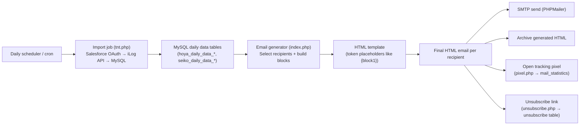

# Full HTML Email Flow (Legacy PHP)

This document describes the **legacy “Full HTML Email” flow** in plain language.

It explains how the system:

- imports Track & Trace data into a database
- builds a complete HTML email per recipient (not just a link)
- optionally sends the email via SMTP
- logs opens and handles unsubscribe

> Scope: this is the **legacy PHP implementation** (pre-SFMC). The purpose of this doc is to understand what must be replicated or replaced in SFMC.

---

## 1) What “Full HTML Email” means

In the “Full HTML Email” flow, the email that the recipient receives already contains the full content (tables with orders/status), rendered as HTML.

It is **not** just a short email with a link to a website.

---

## 2) The main building blocks

### A) Data import job (creates the daily dataset)

- Entry point: [tnt.php](tnt.php)
- Purpose: pull data from external systems and write it into MySQL tables.

Conceptually it does:

1. Authenticate to Salesforce (OAuth)
2. Query which accounts/recipients are subscribed/eligible
3. For each account, call the iLog Track & Trace API (JWT)
4. Store the resulting order/status data into “daily data” tables (e.g. `hoya_daily_data_*`, `seiko_daily_data_*`)

This step prepares the data so it can be used for rendering.

### B) HTML rendering (turns data into email-ready HTML)

- Renderer endpoints: [tracking.php](tracking.php) (and legacy variants like [tracking2.php](tracking2.php), [tracking_seiko_fr.php](tracking_seiko_fr.php))
- Purpose: read a specific account’s data + translation labels and produce HTML by replacing `{tokens}` in a template.

Templates live in:

- HOYA: [assets/snippets/phpimport/templates/template_hoyafr.php](assets/snippets/phpimport/templates/template_hoyafr.php)
- SEIKO: [assets/snippets/phpimport/templates/templates_seikofr.php](assets/snippets/phpimport/templates/templates_seikofr.php)

### C) Email generator/sender (builds a per-recipient email)

- Entry point: [assets/snippets/phpimport/index.php](assets/snippets/phpimport/index.php) (and [assets/snippets/phpimport/index-he.php](assets/snippets/phpimport/index-he.php))
- Purpose: assemble the final HTML email per recipient and optionally send it via PHPMailer/SMTP.

Key actions:

1. Load translations (subject, labels, footer links)
2. Select the correct template
3. Generate the dynamic blocks (tables) from the daily data table
4. Replace `{tokens}` in the template with real values
5. Output the final HTML (and optionally send it)
6. Archive the generated HTML to disk

---

## 3) Step-by-step flow (end-to-end)

### Diagram (high-level)

### Step 1 — Daily import (scheduled)

A scheduler/cron triggers the import job:

- Production reference (from legacy setup): `https://www.hoyavision-service.com/tnt.php`

Result:

- MySQL tables are populated with the newest Track & Trace data.

### Step 2 — Recipient selection

The legacy PHP sender script selects recipients from the database and applies business rules such as:

- “Only send if the customer is subscribed”
- “Do not send to emails that have unsubscribed”

Unsubscribes are stored in the table `unsubscribe`.

### Step 3 — Render blocks (tables) for this recipient

For each recipient/account, the script builds multiple content blocks (HTML tables) from the daily data table.

Examples of blocks (names vary per template):

- new orders
- shipped orders
- deliveries in the next 3 days
- all open orders

### Step 4 — Build the final HTML email

The template files contain placeholders like:

- `{customernumber}`
- `{unsubscribe-url}`
- `{block1}` (a rendered table)

The sender script performs a token replacement (simple string replacement) to produce the final HTML.

### Step 5 — Send (optional)

If sending is enabled, PHPMailer is used to send via an SMTP server.

Important:

- This repository does **not** contain real SMTP credentials.
- Secrets must come from environment variables / private ignored files.

### Step 6 — Archive

The generated HTML is written to an archive folder for traceability/debugging.

### Step 7 — Open tracking (pixel)

The HTML includes a tracking pixel that calls:

- [assets/snippets/phpimport/templates/images/pixel.php](assets/snippets/phpimport/templates/images/pixel.php)

That endpoint records an “open” event into the `mail_statistics` table.

### Step 8 — Unsubscribe

The email contains an unsubscribe link that calls:

- [assets/snippets/phpimport/unsubscribe/unsubscribe.php](assets/snippets/phpimport/unsubscribe/unsubscribe.php)

That endpoint writes the email address into the `unsubscribe` table.

---

## 4) How to explain this to non-developers (one sentence)

Every day the system pulls order data, stores it, then **generates a complete HTML email per customer** by filling a predefined template with the latest data, and finally sends it.

---

## 5) What SFMC typically replaces

In a SFMC migration, these responsibilities are usually moved:

- Recipient selection → SFMC Data Extensions + Journey/Automation
- Email sending → SFMC send engine
- Unsubscribe handling → SFMC standard unsubscribe / preference center
- Tracking → SFMC tracking (opens/clicks)

What may remain external:

- The Track & Trace data import (unless moved into SFMC via API/ETL)
- The per-account HTML rendering logic (if you keep “precompiled HTML” concept)

---

## 6) Safe local testing (no real credentials)

- Import job safe mode: [tnt.php](tnt.php) with `?dryrun=1`
- Renderer preview: [tracking.php](tracking.php) with `?preview=1`

These modes are intended for layout and flow testing without connecting to production systems.
